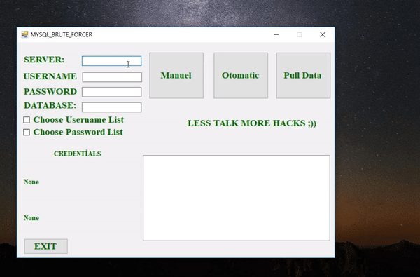
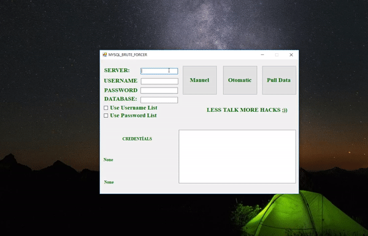

# USAGE - version1.0.1

## Part 1 - Brute Force (Manuel & Otomatic)

## Part 2 - Pull Data

 
<b>Fixed pulling username&password from tables but still not enough</b>

## ISSUES
<b>Listbox horizantal scrolling according data lenght</b> 
<b>Showing tables structs</b>

## AN QUESTION
<b>Which one  is good listbox or listview ?</b>
